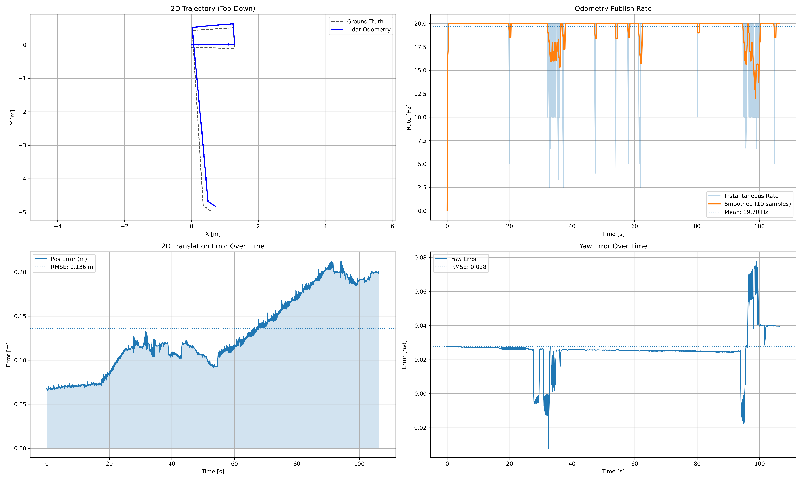

# LiDAR Odometry

Estimates robot's 2D position and orientation in indoor environments by fusing LiDAR point clouds with IMU data. Uses Point-to-Plane ICP to leverage wall geometry and fixed structures for robust motion estimation in constrained spaces.

## Algorithm Pipeline

1. **Point Cloud Preprocessing** - Convert ROS message to PCL, transform to base frame, downsample (0.12m)
2. **Normal Estimation** - Compute surface normals using KD-tree search (k=12 neighbors) for point-to-plane ICP
3. **Motion Prediction** - Generate initial pose guess using IMU yaw rate and velocity-based motion model
4. **Point-to-Plane ICP** - Register current scan to local map minimizing point-to-plane distances (max 50 iterations, 0.8m correspondence)
5. **Pose Constraints** - Apply 2D constraints (zero z-translation, yaw-only rotation) for ground robot motion
6. **Local Map Update** - Maintain sliding window of 15 scans, downsample to 0.15m, transform to world frame

## Setup

1. Make sure you have Docker and VS Code with the Remote - Containers extension installed
2. Clone this repository
3. Copy ROS bag(s) to test against inside the cloned repo dir
4. Open the repository in VS Code
5. When prompted, click "Reopen in Container". This step will install all required deps and build the lidar_odometry package as-well.

## Running Core Logic, Analysis and Report Generation

1. Open a terminal in now ready dev-container
2. Run
```bash
ros2 run lidar_odometry orchestrator <bag_path>
```
**Example:** 
```bash
ros2 run lidar_odometry orchestrator rosbag2_2025_10_27-16_39_13_0.db3
```
3. Generated results will be inside `results` directory


## Performance Metrics

These were generated against a test bag

**ATE RMSE**: 0.1361 m | **Yaw RMSE**: 1.59° | **Avg Rate**: 19.7 Hz

| Metric | Translation | Yaw | Rate (Hz) |
|--------|-------------|-----|-----------|
| RMSE/Mean | 0.1361 m | 1.59° | 19.7 |
| Mean | 0.1288 m | 1.49° | ±1.9 |
| Std Dev | 0.0439 m | 0.56° | 2.5-20.0 |
| Max | 0.2126 m | 4.46° | |

## Analysis Plots

